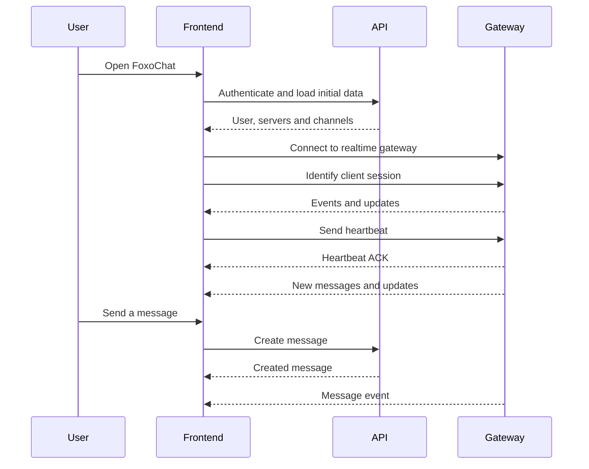

# FoxoChat Frontend

Frontend client of FoxoChat — an open-source messenger web application built with Preact, TypeScript and Rsbuild.

The project contains the web client, desktop build configuration with Tauri, realtime gateway integration and UI for
working with chats, authentication and user settings.

## Resources

- Website
    - https://foxochat.app
- Development website
    - https://dev.foxochat.app
- Backend
    - https://github.com/foxocorp/foxochat-backend
- Discord
    - https://discord.foxochat.app
- GitHub
    - https://github.com/foxocorp

## Tech stack

- Preact
- TypeScript
- Rsbuild
- MobX
- SCSS / PostCSS
- Tauri
- Biome
- Workbox

## Getting started

### Requirements

- Node.js
- pnpm
- Rust and Tauri prerequisites, if you want to run or build the desktop version

### Installation

```bash
pnpm install
```

### Development

Run the web client in development mode:

```bash
pnpm dev
```

Run the desktop client in development mode:

```bash
pnpm dev-desktop
```

### Build

Build the web client:

```bash
pnpm build
```

Build the desktop client:

```bash
pnpm build-desktop
```

### Preview

```bash
pnpm preview
```

### Code quality

Check and apply Biome fixes:

```bash
pnpm check
```

Format the project:

```bash
pnpm format
```

## Environment variables

The frontend can be configured with the following environment variables:

```env
API_URL=https://api.foxochat.app/
CDN_BASE_URL=https://media.foxochat.app/attachments/
```

If these variables are not provided, the application uses the production FoxoChat API and CDN URLs by default.

## Project structure

```text
src/
├── assets/       Static assets used by the application
├── components/   Reusable UI components
├── contexts/     Application contexts
├── gateway/      Realtime gateway integration
├── hooks/        Reusable Preact hooks
├── interfaces/   TypeScript interfaces
├── lib/          Shared libraries and helpers
├── pages/        Application pages
├── scss/         Global styles and SCSS modules
├── services/     API and application services
├── store/        MobX stores
├── types/        Shared TypeScript types
├── utils/        Utility functions
└── index.tsx     Application entry point
```

## Client lifecycle



## Acknowledgements

We would like to thank the following people and projects for helping make FoxoChat Frontend possible:

- Preact for a fast and lightweight UI foundation
- TypeScript for making the codebase safer and easier to maintain
- Tauri for desktop application support
- Foxes, because they are just so cute :3

Without your help, the FoxoChat Frontend project would not have been possible. We are grateful for your participation
and support!

## License

This project is licensed under the MIT license — see [LICENSE](./LICENSE) for details.

If you have any questions or problems with FoxoChat Frontend, please contact us
at [Discord](https://discord.foxochat.app).
